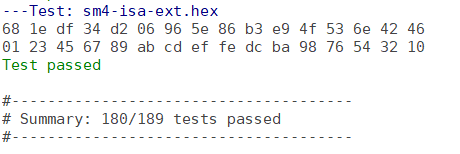

# RISC-V instruction set extensions for SM4 block cipher
In this repo, two instructions are extended to RISC-V ISA, which named sm4.key.rf and sm4.enc.rf respectively. The instruction function unit is embedded into the execution pipeline stage of a 32-bit RISC-V processor named [scr1](https://github.com/syntacore/scr1). 


## 1 brief introduction
Industrial Internet of Things (IoT) devices generate, process, and exchange vast amounts of security and safety-critical data, as well as privacy-sensitive information. These data should be encrypted to protect data confidentiality before transferring. Although software implementation of encryption algorithms is a solution, the performance is low, and the latency is large. To tradeoff between performance and resource overhead, this paper proposes two RISC-V instruction set extensions for the SM4 block cipher. These two instructions are used to implement one iteration of round function of the key expansion algorithm and the encryption algorithm, respectively. The instruction function unit is embedded in the execution pipeline stage of a 32-bit RISC-V processor. Cycle-accurate simulation results show that compared with software implementation without extended instructions, the latency of SM4 block cipher is reduced by at least 85.3\%, and the throughput rate is increased by at least 6.79 times. The implementation results on the Xilinx Spartan-7 FPGA show that the function unit occupies only 247 LUTs. Furthermore, the synthesis results under 180nm process show that the resource overhead of the instruction function unit is only 1790 gates. Compared with related studies, the resource overhead is reduced by at least 35.05\%.

### 1.1 SM4 algorithm
#### 1.1.1 encryption algorithm

#### 1.1.2 key expansion algorithm


### 1.2 RISC-V instruction extension


## 2 how to use?

### 2.1 modify files of the scr1
1) `scr1\src\pipeline\scr1_pipe_idu.sv`
2) `scr1\src\pipeline\scr1_pipe_ialu.sv`
3) `scr1\src\pipeline\scr1_pipe_exu.sv`

### 2.2 add new files
1) `scr1\src\pipeline\sbox.sv`
2) `scr1\src\pipeline\sm4lt.sv`

### 2.3 how to use the extended instruction?

#### 2.3.1 modify the gcc compiler
- download the risc-v gnu toolchain from [here](https://github.com/riscv/riscv-gnu-toolchain)
- modify riscv-opc.h and riscv-opc.c in riscv-binutils
  - riscv-opc.h is in `riscv-binutils/include/opcode`
  - riscv-opc.c is in `riscv-binutils/opcode`
  - you can found ours riscv-opc.c in `modify-the-gnu-toolchains\riscv-opc.c`
  - you can found ours riscv-opc.h in `modify-the-gnu-toolchains\riscv-opc.h`
- compile

#### 2.3.2 use extended instruction with inline assembly language
Example files can be found in `scr1\sim\tests\sm4-isa-ext`. 
The extended instructions must be used with inline assembly language. The following is an example.
```c
	__asm__ __volatile__(
		"mv t0, %[src0]\n\t"
		"mv t1, %[src1]\n\t"
		"mv t2, %[src2]\n\t"
		"mv t3, %[src3]"
		:
		:[src0]"r"(ulbuf[0]), [src1]"r"(ulbuf[1]), [src2]"r"(ulbuf[2]), [src3]"r"(ulbuf[3])
		:"t0", "t1", "t2", "t3"
	);

	while (i < 32)
	{
		__asm__ __volatile__("sm4_enc_rf t3, %[src]" : :[src]"r"(sk[i]): "t0", "t1", "t2", "t3");
		i++;
	}
	__asm__ __volatile__(
		"mv %[dest0], t0\n\t"
		"mv %[dest1], t1\n\t"
		"mv %[dest2], t2\n\t"
		"mv %[dest3], t3"
		:[dest0]"=r"(ulbuf[0]), [dest1]"=r"(ulbuf[1]), [dest2]"=r"(ulbuf[2]), [dest3]"=r"(ulbuf[3]) 
		:
		:"t0", "t1", "t2", "t3"
	);

```

## 3 simulation results

### 3.1 key expansion
2670 ns = 267 $\times$ 10ns, thus **267** clock cycles are needed for key expansion algorithm.


### 3.2 encryption
2310 ns = 231 $\times$ 10ns, thus **231** clock cyles are needed for the encryption of a 128-bit data block.


### 3.3 scr1 simulation log


### 3.4 more simulation results
more simulation results can be found in `images`.