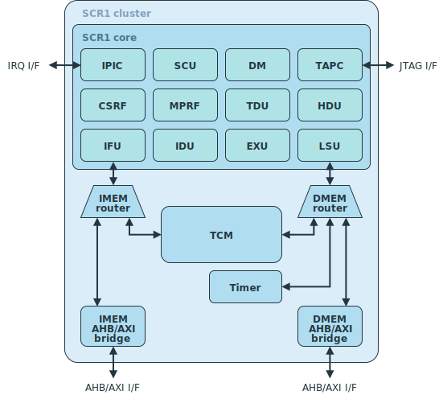

# SCR1 RISC-V Core

SCR1 is an open-source and free to use RISC-V compatible MCU core, designed and maintained by Syntacore. It is industry-grade and silicon-proven (including full-wafer production), works out of the box in all major EDA flows and Verilator, and comes with extensive collateral and documentation.



## Key features
* Open sourced under SHL-license - unrestricted commercial use allowed
* RV32I|E[MC] ISA
* Machine privilege mode
* <15 kGates in basic RV32EC configuration
* 2 to 4 stage pipeline
* Optional IPIC with 16 IRQs
* Optional RISC-V Debug subsystem with JTAG interface
* 32-bit AXI4/AHB-Lite external interface
* Written in SystemVerilog
* Optimized for area and power
* 3 predefined configurations
* A number of fine-tuning options
* Verification suite provided
* Extensive documentation

For more information, see [SCR1 External Architecture Specification](https://github.com/syntacore/scr1/blob/master/docs/scr1_eas.pdf) and [SCR1 User Manual](https://github.com/syntacore/scr1/blob/master/docs/scr1_um.pdf).

## Repository contents

|Folder | Description
|------ | -----------
|**docs**                          | **SCR1 documentation**
|├─ scr1_eas.pdf                   | External Architecture Specification
|└─ scr1_um.pdf                    | User Manual
|**src**                           | **SCR1 RTL source and testbench files**
|├─ includes                       | Header files
|├─ pipeline                       | Pipeline source files
|├─ core                           | Core top source files
|├─ top                            | Cluster source files
|└─ tb                             | Testbench files
|**sim**                           | **Tests and scripts for simulation**
|├─ tests/common                   | Common source files for tests
|├─ tests/riscv_isa                | Common source files for RISC-V ISA tests
|├─ tests/riscv_compliance         | Common source files for RISC-V Compliance tests
|├─ tests/benchmarks/dhrystone21   | Dhrystone 2.1 source files
|├─ tests/benchmarks/coremark      | Coremark platform specific source files
|├─ tests/vectored_isr_sample      | Simple test example for vectored interrupt mode
|├─ tests/hello                    | Simple "hello" test
|└─ verilator_wrap                 | Wrappers for Verilator simulation

## SCR1 source file lists

SCR1 source file lists of SCR1 can be found in [./src](https://github.com/syntacore/scr1/tree/master/src):
* **core.files**    - all synthesized file sources of the SCR1 core
* **ahb_top.files** - synthesized file sources of AHB cluster
* **axi_top.files** - synthesized file sources of AXI cluster
* **ahb_tb.files**  - testbench file sources for AHB cluster (for simulation only)
* **axi_tb.files**  - testbench file sources for AXI cluster (for simulation only)

Library with header files to include is [./src/includes/](https://github.com/syntacore/scr1/tree/master/src/includes)

## Simulation quick start guide

### 1. Prerequisites

RISC-V GCC toolchain is required to compile the software. You can use pre-built binaries or build the toolchain from scratch.

#### 1.1. Using pre-built binary tools

Pre-built RISC-V GCC toolchain with support for all SCR1 architectural configurations is available for download from http://syntacore.com/page/products/sw-tools.
1. Download the archive for your platform: *.tar.gz* for Linux, *.zip* for Windows.
2. Extract the archive to your preferred directory `<GCC_INSTALL_PATH>`.
3. Add the `<GCC_INSTALL_PATH>/bin` folder to the $PATH environment variable:
```
    export PATH=<GCC_INSTALL_PATH>/bin:$PATH
```
#### 1.2. Building tools from source

You can build the RISC-V GCC toolchain from sources, stored in official repo https://github.com/riscv/riscv-gnu-toolchain

Instructions on how to prepare and build the toolchain can be found on https://github.com/riscv/riscv-gnu-toolchain/blob/master/README.md

We recommend using the multilib compiler. Please note that RV32IC, RV32E, RV32EM, RV32EMC, RV32EC architectural configurations are not included in the compiler by default. If you plan to use them, you will need to include the appropriate libraries by yourself before building.

After the building, be sure to add the `<GCC_INSTALL_PATH>/bin` folder to the $PATH environment variable

### 2. Included tests

By default, the simulation package includes the following tests:

* **hello**                - simple "hello" program
* **riscv_isa**            - RISC-V ISA tests
* **riscv_compliance**     - RISC-V Compliance tests
* **dhrystone21**          - Dhrystone benchmark
* **coremark**             - Coremark benchmark
* **vectored_isr_sample**  - test sample for vectored interrupts

Some of the tests depend on the selected architecture (e.g. rv32i|e base, supported extensions or IPIC), and therefore can not be used for all core configurations (these are skipped automatically).

Please, refer to *SCR1 User Manual* chapter *"5.2. Test subset"* for further details.

#### 2.1. Prepare RISC-V ISA tests

Clone RISC-V ISA tests to your preferred directory `<RISCV_TESTS_PATH>`

```
    git clone https://github.com/riscv/riscv-tests
    cd riscv-tests
    git checkout a9433c4daa287fbe101025f2a079261a10149225
```

Set the $RISCV_TESTS environment variable accordingly:

```
    export RISCV_TESTS=<RISCV_TESTS_PATH>
```

#### 2.2. Prepare RISC-V Compliance tests

Clone RISC-V Compliance tests to your preferred directory `<RISCV_COMPLIANCE_TESTS_PATH>`

```
    git clone https://github.com/riscv/riscv-compliance
    cd riscv-compliance
    git checkout 9f280717f26f50833357db9bfb77a8c79835f162
```

Set the $RISCV_COMPLIANCE_TESTS environment variable accordingly:

```
    export RISCV_COMPLIANCE_TESTS=<RISCV_COMPLIANCE_TESTS_PATH>
```

#### 2.3. Prepare Coremark benchmark sources

Clone Coremark benchmark to your preferred directory `<COREMARK_PATH>`.
```
    git clone https://github.com/eembc/coremark
```

Copy the following files from the root of `<COREMARK_PATH>` into SCR1 directory `./sim/tests/benchmarks/coremark/src`:

* `core_main.c`
* `core_list_join.c`
* `coremark.h`
* `core_matrix.c`
* `core_state.c`
* `core_util.c`

### 3. Running simulations

To build RTL, compile and run tests from the repo root folder:

```
    make run_<SIMULATOR> BUS=<AHB, AXI> ARCH=<I, IM, IMC, IC, E, EM, EMC, EC> IPIC=<0, 1>
```

By default, if not specified, the following parameters are used: `BUS=AHB ARCH=IMC IPIC=0`.

Build and run parameters can be configured in the `./Makefile`.

After all the tests have finished, the results can be found in `build/<SIM_CFG>/test_results.txt`.

#### 3.1. Simulator selection

Currently supported simulators:

* **run_modelsim** - ModelSim by Mentor Graphics or Intel
* **run_vcs** - Synopsys VCS
* **run_ncsim** - Cadence NCSim
* **run_verilator** - Verilator
* **run_verilator_wf** - Verilator with waveforms support

Please note that RTL simulator executables should be in your $PATH variable.

For the run_verilator_wf option, a waveform is generated for all tests performed and saved in `./build/<SIM_CFG>/simx.vcd`.

#### 3.2. Architectural configuration

The RISC-V toolchain automatically uses the selected ARCH for code compilation.

If IPIC option is set to 1, then the test for vectored interrupts will be used in the simulation.

Please make sure that selected ARCH and IPIC matches architectural configuration of SCR1 RTL.
Architectural parameters of SCR1 core can be configured in `./src/includes/scr1_arch_description.svh`

## SCR1 SDKs

FPGA-based SDKs are available at the https://github.com/syntacore/scr1-sdk.

Repo contains:
* Pre-build images and open designs for several standard FPGAs boards:
  * Digilent Arty (Xilinx)
  * Digilent Nexys 4 DDR (Xilinx)
  * Arria V GX Starter (Intel)
  * Terasic DE10-Lite (Intel)
* Software package:
  * Bootloader
  * Zephyr RTOS
  * Tests\SW samples
* User Guides for SDKs and tools


## Contacts

Report an issue: https://github.com/syntacore/scr1/issues

Ask a question: scr1@syntacore.com

